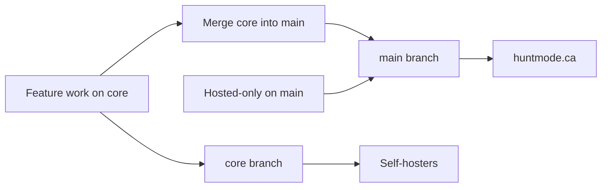

# HuntMode editions: hosted vs core

HuntMode ships as two long-lived git branches with shared code and env-driven defaults.

| | **`main` (hosted)** | **`core` (self-host / OSS)** |
|---|---|---|
| **Production** | [huntmode.ca](https://huntmode.ca) via `./deploy.sh` | Docker / `npm run build` |
| **Edition env** | `HUNTMODE_EDITION=hosted` | `HUNTMODE_EDITION=core` |
| **Sign-up** | Rate-limited open signup + admin stats | Open signup, no hourly cap |
| **In-app AI** | BYOK; admin can use platform env keys on hosted | BYOK only |
| **Onboarding AI** | Platform `GOOGLE_AI_API_KEY` when set | Self-hoster `GOOGLE_AI_API_KEY` or BYOK |
| **Analytics prompt** | Optional “help improve” copy in Settings | Off |
| **Tipping UI** | When `NEXT_PUBLIC_TIP_URL` is set | Hidden |

## Code layout

- [`lib/edition.ts`](../lib/edition.ts) — edition detection and feature flags
- [`lib/platform-ai.ts`](../lib/platform-ai.ts) — BYOK vs platform key policy
- [`lib/is-admin.ts`](../lib/is-admin.ts) — `ADMIN_EMAIL` from env

Set both server and client admin identity:

```env
ADMIN_EMAIL=you@example.com
NEXT_PUBLIC_ADMIN_EMAIL=you@example.com
```

## Development workflow



1. **Core features** land on `core` (or feature branches merged to `core`).
2. Before production deploy, **merge `core` → `main`** and resolve conflicts.
3. **Hosted-only** work commits on `main` or behind `isHostedEdition()` / edition flags.
4. Deploy hosted production from **`main` only**: `./deploy.sh`

## Feature classification

### Core (complete on `core`)

- Application pipeline, dashboard, goals/streaks
- Master resume editor
- BYOK AI: generate, fit, suggest, incorporate, revision chat, interview prep/chat
- CV + cover letter PDF/DOCX export, contact profile in Settings
- Onboarding wizard (server AI optional via self-hoster `GOOGLE_AI_API_KEY`)

### Hosted-only (or flagged)

- Sign-up rate limits + admin signup stats
- Onboarding server AI subsidized by platform key
- Tip celebration / tipping UI
- Future: `HUNTMODE_PLATFORM_AI_FOR_USERS=true` for subsidized in-app AI

### Shared, copy differs

- PostHog: enabled when `NEXT_PUBLIC_POSTHOG_KEY` is set; hosted shows optional analytics note

## Self-host quick start

```bash
git checkout core
cp .env.example .env.local
# Set HUNTMODE_EDITION=core, Firebase, ADMIN_EMAIL, BYOK keys
npm install && npm run dev
```

See [firestore-rules-core.md](./firestore-rules-core.md) for admin rules setup.

## Hosted quick start

Use `main`, set `HUNTMODE_EDITION=hosted`, configure Firebase + optional PostHog/tip URL.
Production deploy: `./deploy.sh` (local build + rsync to PM2 server).
